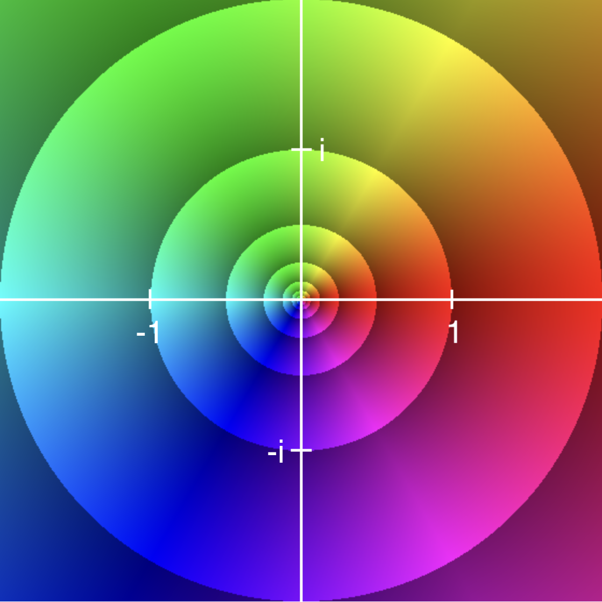

Domain coloring is a technique for visualizing a complex-valued function; that is, a function which takes a complex number as input and returns a complex number as output. Each point in the complex plane is assigned a color according to the following color wheel:

Thus, the positive real numbers are colored red, the negative real numbers are colored cyan, etc. A complex function f is drawn by coloring the pixel at the coordinates (Re(z), Im(z)) with the color assigned to the output f(z).

You can explore the domain colorings of complex functions below. Type a function expression into the text box and use your mouse/fingers to drag and zoom the complex plane.
