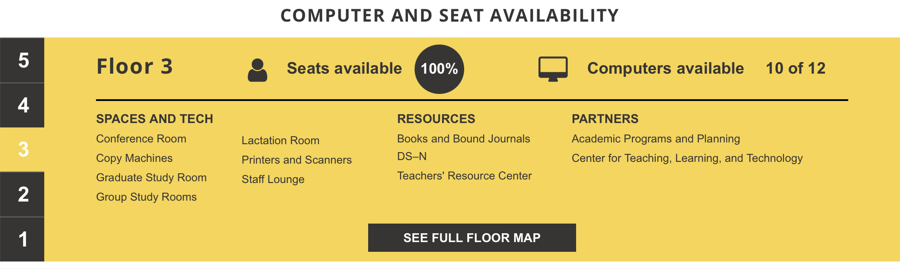
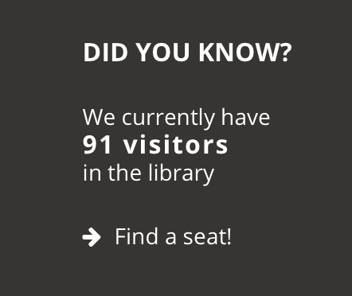

**Summary**
* **Years:** 2015-2019
* **Languages:** HTML, CSS, Javascript
* **Frameworks:** Wordpress, REST API
* **Description:** Student web developer for library website. Responsible for implementation and maintenance of frontend.

My first job as a web developer was a student position at [Robert E. Kennedy Library](https://library.calpoly.edu) on the campus of Cal Poly SLO. From 2015 to 2019, I assisted in the implementation and maintenance of the frontend of the library website. At the time, the website was built on Wordpress and the frontend was basic HTML/CSS/Javascript (I'm not sure what the current stack is, but I imagine it's more modern).

Most of my job involved working with our team of student graphic designers, who created mock-ups of the website UX/UI. For a while (roughly 2017-2019), I was the sole developer responsible for implementing the designs (of course, my novice code was audited by the lead developer before going live). It was really a fantastic experience to have such responsibility and to see my work get used by the student population.

My proudest accomplishment during my time at the library was the implementation of **live visitor data** onto the front page. The backend developers maintained an API to retrieve live computer and wi-fi usage throughout the library. I wrote code to retrieve JSON objects from the database and estimate how many visitors were currently on each floor in the library. The front page of the website displayed this information:

The website footer also displayed a total visitor count estimate:

Many of my fellow students frequently used this feature to know how busy the library was before heading over to study. Sadly, it seems that this feature has been removed from the site since I graduated.