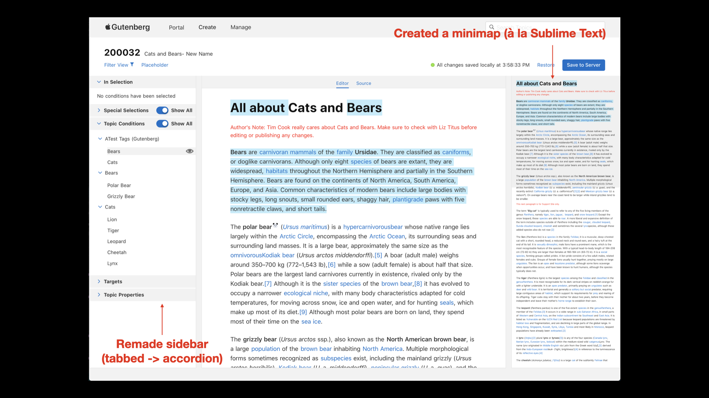

**Summary**
* **Years:** 2019-2020
* **Languages:** React, Typescript
* **Frameworks:** Slate.js, Gatsby
* **Description:** Frontend developer for an internal content authoring tool at Apple.

While at Apple, I built and maintained a React (Gatsby) internal content authoring tool used to manage Apple Support documentation. At the time, the existing Apple Support content authoring tool was severely outdated, and I joined a team which was creating an updated version. Below is a screenshot of some of my first contributions to the project:

This screenshot also showcases a core feature of Gutenberg: text can be tagged with metadata and linked to other articles. In this example, the word "Bears" is highlighted in blue; hovering on "Bears" will allow the author to view and edit the tagged metadata.

In order to accomplish this feature, a co-worker and I reworked the project to use Slate.js, a flexible text editor framework which is fully customizable. Beforehand, we were using a different text editor framework, and it was risky to re-write the entire project with Slate.js, but it paid off in the end: the features our team had been struggling to implement became much easier.