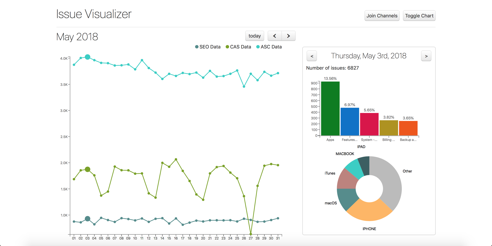

**Summary**
* **Years:** 2018
* **Languages:** React, Python, MQL
* **Frameworks:** MongoDB, Meteor, Plotly
* **Description:** During my internship at Apple, I wrote the frontend and backend for an internal support issue data visualization web app.

During the summer of 2018, I was a software development intern at Apple. My team worked on several internal tools for the Apple Support ecosystem. One project the team had not gotten around to was a visualization tool for analyzing data from our different support channels. I decided to take this on as my internship project.

The data came from three separate channels: Contact Apple Support (CAS), Apple Store Channel (ASC), and SEO data. I pulled live data into a MongoDB instance via a Python script, and queried the database in React using Meteor.

The charts were generated using Plotly. The default view was a calendar displaying the number of issues received each day. The chart could be toggled to a line graph, displaying issues received over a day/week/month. The line graph could be split into 3 graphs, one for each support channel.