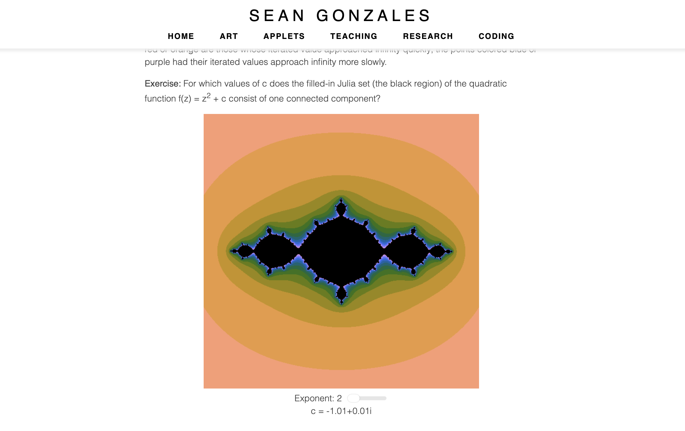

**Summary**
* **Years:** 2017-present
* **Languages:** React, WebGL, GraphQL
* **Frameworks:** Gatsby, p5.js
* **Description:** I built my [personal website](/) using React (Gatsby). It also contains applets using p5.js and WebGL.

When I was lucky enough to land the domain [seangonzales.com](/), I knew I had to make a sleek, modern website to host my various projects. Originally, my personal website was a basic Wordpress site, but I rewrote the entire site to use React (Gatsby) after my internship at Apple.

One aspect of my website which I hope to expand soon is the [applets page](/applets). I love using my software experience to make interactive online tools for math discovery. The above image shows the Julia sets applet I made, which allows the user to explore different Julia sets using their mouse and a slider.
