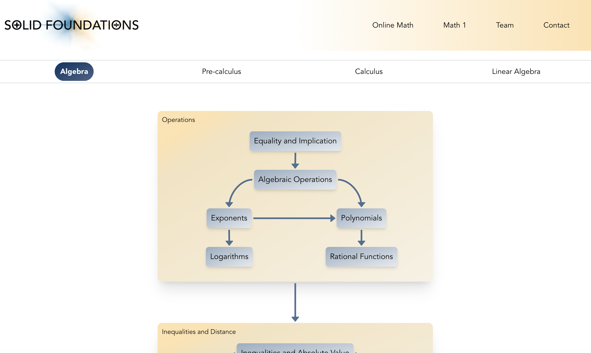
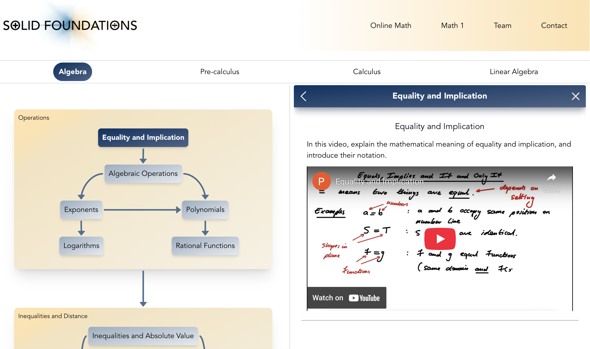

**Summary**
* **Years:** 2024-present
* **Languages:** React, Typescript, Tailwind
* **Frameworks:** Next.js, xyflow
* **Description:** I built a [demo web hub](https://solid-foundations.netlify.app) for the Solid Foundations project at UC Berkeley, which aims to address the gap in foundational math knowledge of undergraduate students. The website secured a $1M donation to fully develop the project.

In 2024, I started working with Professor Alex Paulin of the UC Berkeley math department on a weekly workshop titled "Pre-calculus Essentials". The goal of the workshop was to address a growing issue plaguing many universities: more and more students are entering college with severe learning gaps in foundational math such as algebra, trigonometry, and geometry. Eventually, this workshop became a full course called Math 1.

We had amassed quite a lot of material for this course: pre-recorded video lectures, worksheets, etc. Yet, we were not reaching as many students as we had hoped. So, we decided to put together an online hub which would not only host all of this material, but could be used by students as a mini-course on the foundations of lower division mathematics. I wrote this [demo website](https://solid-foundations.netlify.app) using React (Next.js) as a proof-of-concept.

The most important section of the site is the [online math page](https://solid-foundations.netlify.app/online-math?initFlow=algebra), which features a flow chart of topics in a given subject:

When a user clicks on a topic, it opens a side panel with one or more lecture videos:

Professor Paulin presented the website to a donor who was interested in supporting the project; we managed to secure $1M in funding to flesh out the website. Currently, Professor Paulin is in the process of hiring more developers to build the site.
